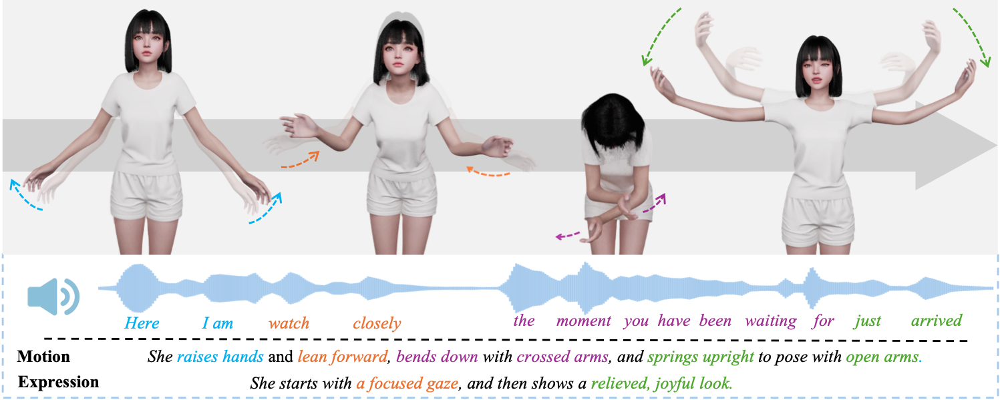
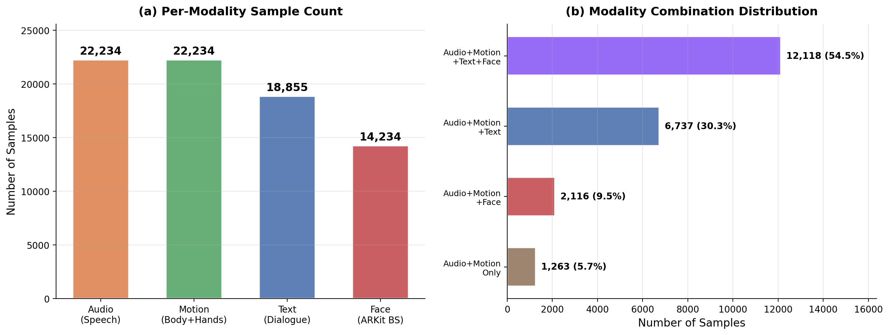
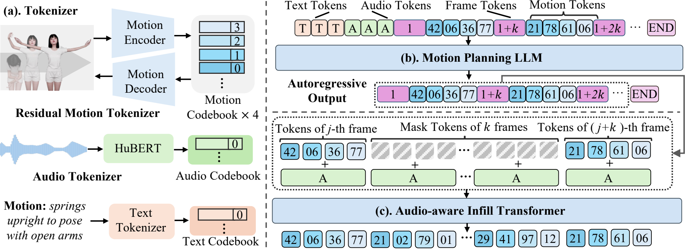
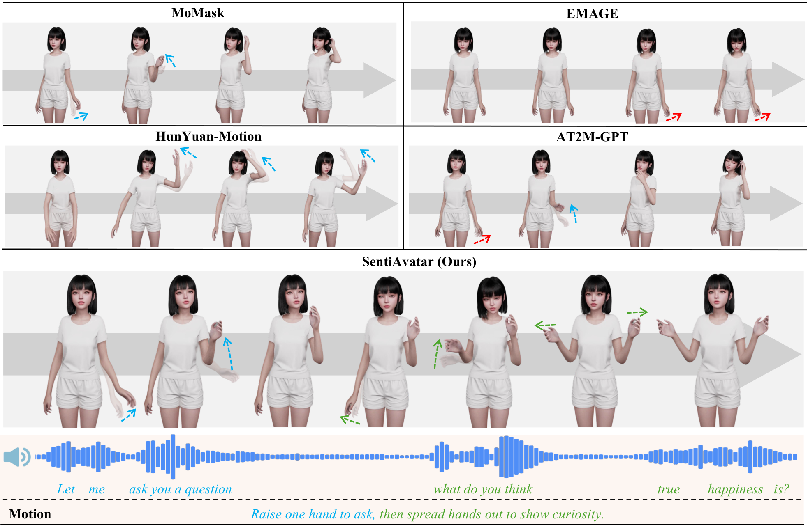

<p align="center">
  
</p>

# SentiAvatar: Towards Expressive and Interactive Digital Humans
<p align="center">
  <a href="https://arxiv.org/abs/2604.02908"></a>
  <a href="#license"></a>
  <a href="#dataset"></a>
</p>

<p align="center">
  <a href="#">Chuhao Jin</a><sup>1,2,*</sup>&ensp;
  <a href="#">Rui Zhang</a><sup>2,*</sup>&ensp;
  <a href="#">Qingzhe Gao</a><sup>2</sup>&ensp;
  <a href="#">Haoyu Shi</a><sup>3</sup>&ensp;
  <a href="#">Dayu Wu</a><sup>2</sup>&ensp;
  <a href="#">Yichen Jiang</a><sup>2</sup>&ensp;
  <a href="#">Yihan Wu</a><sup>1</sup>&ensp;
  <a href="#">Ruihua Song</a><sup>1,†</sup>
</p>

<p align="center">
  <sup>1</sup> Gaoling School of Artificial Intelligence, Renmin University of China<br>
  <sup>2</sup> SentiPulse &ensp;<br>
  <sup>3</sup> College of Computer Science, Inner Mongolia University<br>
  <sub>* Equal contribution. Chuhao Jin led this project. &ensp; † Corresponding author.</sub>
</p>

<p align="center">
  <a href="https://arxiv.org/abs/2604.02908">📄 Paper</a> &ensp;|&ensp;
  <a href="https://sentiavatar.github.io/">🌐 Project Page</a> &ensp;|&ensp;
  <a href="https://huggingface.co/datasets/Chuhaojin/SuSuInterActs">🤗 Dataset</a> &ensp;|&ensp;
  <a href="https://sentiavatar.github.io/#demo">🎬 Demo Video</a>
</p>

---

## 🔥 Highlights

- 📊 **SuSuInterActs Dataset** — 21K clips, 37 hours of synchronized speech + full-body motion + facial expressions captured via optical motion capture
- 🧠 **Plan-then-Infill Architecture** — Decouples sentence-level semantic planning from frame-level prosody-driven interpolation
- 🏆 **State-of-the-Art** — R@1 43.64% (nearly 2× the best baseline) on SuSuInterActs; FGD 4.941, BC 8.078 on BEATv2
- ⚡ **Real-time** — Generates 6 seconds of motion in 0.3 seconds with unlimited multi-turn streaming

<p align="center">
  
  <br>
  <sub><b>Figure 1:</b> SentiAvatar generates high-quality 3D human motion and expression, which are semantically aligned and frame-level synchronized. The same color indicates the same time step.</sub>
</p>

## Abstract

We present **SentiAvatar**, a framework for building expressive interactive 3D digital humans, and use it to create **SuSu**, a virtual character that speaks, gestures, and emotes in real time. Achieving such a system remains challenging, as it requires jointly addressing three key problems: the lack of large-scale high-quality multimodal data, robust semantic-to-motion mapping, and fine-grained frame-level motion-prosody synchronization.

To solve these problems, first, we build **SuSuInterActs** (21K clips, 37 hours), a dialogue corpus captured via optical motion capture around a single character with synchronized speech, full-body motion, and facial expressions. Second, we pre-train a **Motion Foundation Model** on 200K+ motion sequences, equipping it with rich action priors that go well beyond the conversation. We then propose an audio-aware **plan-then-infill** architecture that decouples sentence-level semantic planning from frame-level prosody-driven interpolation, so that generated motions are both semantically appropriate and rhythmically aligned with speech.

<details>
<summary>中文摘要 (Chinese Abstract)</summary>

我们提出了 **SentiAvatar**，一个用于构建富有表现力的交互式3D数字人的框架。该系统采用三阶段流水线：(1) LLM Motion Planner 根据动作标签和音频预测稀疏关键帧；(2) Mask Transformer 基于音频特征进行滑动窗口插帧；(3) RVQVAE Decoder 将离散 token 解码为连续动作序列。此外还集成了 Face VQVAE + HuBERT 的面部动画生成模块。

</details>

## 📊 Dataset: SuSuInterActs

<p align="center">
  
</p>

We open-source the **SuSuInterActs** dataset with the following content:

| Type | Directory | Format | Description |
|------|-----------|--------|-------------|
| 🎭 Face | `SuSuInterActs/arkit_data/` | `.npy` | ARKit facial BlendShape values (51 dims) |
| 🔊 Audio | `SuSuInterActs/wav_data/` | `.wav` | 16kHz mono speech audio |
| 💃 Motion | `SuSuInterActs/motion_data/` | `.npy` | 63-joint 6D rotation + root displacement |
| 📝 Text | `SuSuInterActs/text_data/` | `.json` | Action/expression tags + dialogue text |
| 📋 Splits | `SuSuInterActs/split/` | `.txt` | Train (19K) / Val (635) / Test (1479) |


### Motion Data Format

Each `.npy` file is a dictionary:
```python
{
    "body": np.ndarray,   # (T, 153) = root_offset(3) + body_6d(25×6)
    "left": np.ndarray,   # (T, 120) = left_hand_6d(20×6)
    "right": np.ndarray,  # (T, 120) = right_hand_6d(20×6)
}
```
- Frame rate: **20 FPS**
- Joints: **63** (25 body + 20 left hand + 20 right hand)
- Rotation: 6D rotation representation
- Root displacement: velocity form (differential encoding)

### Text Format

`text_data/motion2text.json`:
```json
{
    "path/to/sample_name": "【表情：认真聆听】【动作：缓慢点头】嗯嗯，这样啊...",
    ...
}
```

## 🧠 Method Overview

<p align="center">
  
  <br>
  <sub>Overview of SentiAvatar. (a) Multi-modal inputs are quantized into tokens via encoders. (b) LLM planner predicts sparse keyframe tokens for high-level dialogue content. (c) Audio-aware Infill Transformer performs dense, prosody-driven interpolation for fine-grained temporal synchronization.</sub>
</p>

Our pipeline consists of three stages:

1. **Motion VQ-VAE (RVQVAE)** — Encodes continuous motion into discrete tokens with a 4-layer residual codebook (512 codes each)
2. **LLM Motion Planner** — A fine-tuned Qwen2-0.5B predicts sparse keyframe motion tokens (every 4th frame) conditioned on action tags + audio tokens
3. **Audio-Aware Infill Transformer** — A masked transformer fills in the remaining 3 frames between each pair of keyframes using HuBERT audio features, achieving prosody-aligned dense motion

## ⚙️ Installation

```bash
# Clone the repository
git clone https://github.com/SentiAvatar/SentiAvatar.git
cd SentiAvatar

# Create environment
conda create -n sentiavatar python=3.10 -y
conda activate sentiavatar

# Install dependencies
pip install -r requirements.txt
```

## 📦 Model Checkpoints

Download all model weights from 🤗 HuggingFace:

👉 **[https://huggingface.co/Chuhaojin/SentiAvatar](https://huggingface.co/Chuhaojin/SentiAvatar)**

```bash
# Option 1: Using git lfs
git lfs install
git clone https://huggingface.co/Chuhaojin/SentiAvatar checkpoints/

# Option 2: Using huggingface-cli
pip install huggingface_hub
huggingface-cli download Chuhaojin/SentiAvatar --local-dir checkpoints/
```

Place the downloaded files into the `checkpoints/` directory. The expected structure:

| Model | Description | Size |
|-------|-------------|------|
| `checkpoints/llm/` | Qwen2-0.5B SFT (Motion Token Planner) | 1.1 GB |
| `checkpoints/mask_transformer/` | Audio-Motion Mask Transformer | 276 MB |
| `checkpoints/rvqvae/` | Residual VQ-VAE (body motion codec) | 754 MB |
| `checkpoints/face_vqvae/` | Face VQ-VAE + weight matrices | 50 MB |
| `checkpoints/chinese-hubert-base/` | Chinese HuBERT audio encoder | 361 MB |
| `checkpoints/hubert_kmeans/` | HuBERT K-means quantizer (layer9 → tokens) | 1.5 MB |
| `checkpoints/eval_model/` | ChronAccRet evaluation model | 434 MB |

## 🚀 Inference

### Data Preprocessing (Required for Batch Mode)

Before running batch inference, you need to preprocess the raw dataset to generate intermediate data:

```bash
# Preprocess all data (audio features + audio tokens + motion tokens)
python scripts/preprocess_data.py --all --device cuda:0

# Or separately:
python scripts/preprocess_data.py --audio   # HuBERT features + K-means tokens
python scripts/preprocess_data.py --motion  # RVQVAE motion tokens
```

This generates three directories under `data/`:
- `audio_features_hubert_layer9_fps10/` — HuBERT layer9 features @10fps
- `audio_tokens_hubert_layer9_fps10/` — K-means quantized audio tokens @10fps
- `motion_token_data/` — RVQVAE encoded motion tokens (for GT comparison)

### Mode 1: Test Set Evaluation (Batch Mode)

Run inference on the entire test set and generate BVH/JSON outputs:

```bash
# Step 1: Preprocess data (if not done)
python scripts/preprocess_data.py --all

# Step 2: Start vLLM service (background)
bash scripts/start_vllm_server.sh checkpoints/llm 8095 0

# Step 3: Run batch inference
bash scripts/run_test.sh 8095 0
```

Output: `output/reconstructed/` (BVH + JSON + WAV per sample)

### Mode 2: Single Case Inference

Generate motion from your own audio + action tag:

```bash
# Make sure vLLM service is running
bash scripts/start_vllm_server.sh checkpoints/llm 8095 0

# 🚀 Quick demo (uses built-in example audio, no extra data needed)
bash scripts/run_single_infer.sh

# Custom inference with your own audio
bash scripts/run_single_infer.sh \
    --audio_path /path/to/your/audio.wav \
    --action_text "动作：点头微笑" \
    --output_dir ./output_single
```

Or use the Python script directly:
```bash
cd motion_generation
python single_case_infer.py \
    --audio_path /path/to/audio.wav \
    --action_text "动作：挥手打招呼" \
    --output_dir ./output_single \
    --vllm_port 8095
```

**Output files:**
- `<name>.bvh` — BVH motion file (viewable in Blender)
- `<name>.json` — Animation data (UE engine format)
- `<name>.wav` — Corresponding audio file

## 📊 Experimental Results

### Quantitative Comparison on SuSuInterActs

**Bold**: best; ↑/↓: higher/lower is better. ESD in seconds. "†" indicates token-by-token autoregressive generation.

| Method | Condition | R@1 ↑ | R@2 ↑ | R@3 ↑ | FID ↓ | ESD ↓ | Diversity ↑ |
|--------|-----------|-------|-------|-------|-------|-------|-------------|
| Real Motion | — | 62.20 | 73.56 | 78.70 | 0.000 | 0.308 | 22.61 |
| *Audio-only methods* | | | | | | | |
| EMAGE | Audio | 5.00 | 9.40 | 13.32 | 441.6 | 0.606 | 12.92 |
| A2M-GPT† | Audio | 8.72 | 15.96 | 20.08 | 13.66 | 0.477 | 22.23 |
| *Text-only methods* | | | | | | | |
| HunYuan-Motion | Text | 5.21 | 8.59 | 11.9 | 352.56 | 0.708 | 16.92 |
| T2M-GPT | Text | 23.12 | 30.49 | 35.43 | 67.78 | 0.721 | 20.65 |
| MoMask | Text | 34.55 | 46.58 | 54.29 | 36.25 | 0.471 | 22.03 |
| *Audio + Text methods* | | | | | | | |
| AT2M-GPT† | Audio, Text | 27.52 | 36.11 | 41.38 | 18.491 | 0.503 | 22.36 |
| **SentiAvatar (Ours)** | **Audio, Text** | **43.64** | **54.94** | **61.84** | **8.912** | **0.456** | **22.41** |
| *Improvement (%)* | | *+26.3* | *+17.9* | *+13.9* | *+34.8* | *+3.2* | *+0.2* |

### Qualitative Comparison

<p align="center">
  
  <br>
  <sub>Qualitative comparison of generated motions across methods. Texts and arrows of the same color indicate the same time step. Red arrows indicate incorrect actions.</sub>
</p>

## 📏 Evaluation

Evaluate generated motion quality using our ChronAccRet evaluation model:

```bash
bash scripts/run_eval.sh ./output/reconstructed 0
```

**Metrics:**
| Metric | Description | Better |
|--------|-------------|--------|
| **R@K** | Text-motion retrieval recall @K | Higher ↑ |
| **FID** | Fréchet Inception Distance | Lower ↓ |
| **Diversity** | Generation diversity in latent space | Higher ↑ |
| **ESD** | Event Sync Distance (seconds) | Lower ↓ |

## 🔧 Motion Visualization

Convert `.npy` motion data to BVH files for viewing in Blender or other 3D software:

```bash
# Single file conversion
python tools/visualize_motion.py \
    --input data/motion_data/path/to/sample.npy \
    --output output_vis/sample.bvh

# Batch conversion (max 10 files)
python tools/visualize_motion.py \
    --input_dir data/motion_data \
    --output_dir output_bvh \
    --max_files 10

# Output both BVH and JSON
python tools/visualize_motion.py \
    --input data/motion_data/sample.npy \
    --output sample.bvh \
    --save_json
```

## 🏗️ Project Structure

```
SentiAvatar/
├── motion_generation/          # 🎯 Motion generation module
│   ├── pipeline_infer.py       #    LLM + Mask Transformer pipeline
│   ├── single_case_infer.py    #    Single-case inference script
│   ├── reconstruct_from_tokens.py  # Token → BVH/JSON decoder
│   ├── vllm_server.py          #    vLLM server for LLM inference
│   ├── models/                 #    Model definitions (RVQVAE, Mask Transformer)
│   ├── actions/                #    Post-processing (BVH/JSON conversion)
│   ├── utils/                  #    Utilities and rotation tools
│   └── meta/                   #    Skeleton templates, normalization params
├── evaluation/                 # 📊 Evaluation module (ChronAccRet)
├── tools/                      # 🔧 Visualization tools
├── scripts/                    # 🚀 Shell scripts
├── data/                       # 📁 Dataset (SuSuInterActs)
└── checkpoints/                # 💾 Model weights
```

## 📝 Citation

If you find this work useful, please cite our paper:

```bibtex
@article{jin2026sentiavatar,
  title={SentiAvatar: Towards Expressive and Interactive Digital Humans},
  author={Jin, Chuhao and Zhang, Rui and Gao, Qingzhe and Shi, Haoyu and Wu, Dayu and Jiang, Yichen and Wu, Yihan and Song, Ruihua},
  journal={arXiv preprint arXiv:2604.02908},
  year={2026}
}
```

## ⭐ Star History

[](https://star-history.com/#SentiAvatar/SentiAvatar&Date)

##### If you like this project, please give it a star ⭐! It would be a great encouragement for us and help more people discover this work.

## 🙏 Acknowledgments
The authors would like to sincerely thank all collaborators for their valuable contributions to this work. In particular, special thanks to Shi Xueliang and Pan Xuanyue for leading the art design and data production efforts. The project also benefited greatly from the contributions of team members: Shi Xueliang, Yu Yongchang, Li Xing, and Liu Xueying in art design; Pan Xuanyue, Li Huixian, Yang Yijia, Zhang Wenxuan, and Wang Wei (UE) in data production. Their dedicated work and collaboration were essential to the successful completion of this research.

We also thank the following open-source projects:

- [vLLM](https://github.com/vllm-project/vllm) — High-throughput LLM inference engine
- [HuggingFace Transformers](https://github.com/huggingface/transformers) — Pre-trained model framework
- [Chinese-HuBERT](https://huggingface.co/TencentGameMate/chinese-hubert-base) — Chinese speech encoder
- [Qwen2](https://github.com/QwenLM/Qwen2) — Base language model

## License

This project is licensed under [SentiPulse Non-Commercial Source License v1.0](LICENSE).

**You are free to**: share, adapt, and build upon this work for non-commercial purposes.  
**You may NOT**: use this project, its models, or data for any commercial purpose.

For commercial licensing, please contact the authors.

---

<p align="center">
  Made with ❤️ by the SentiPulse Team
</p>
